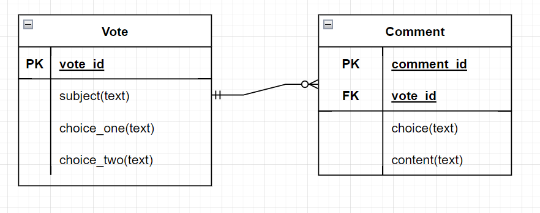
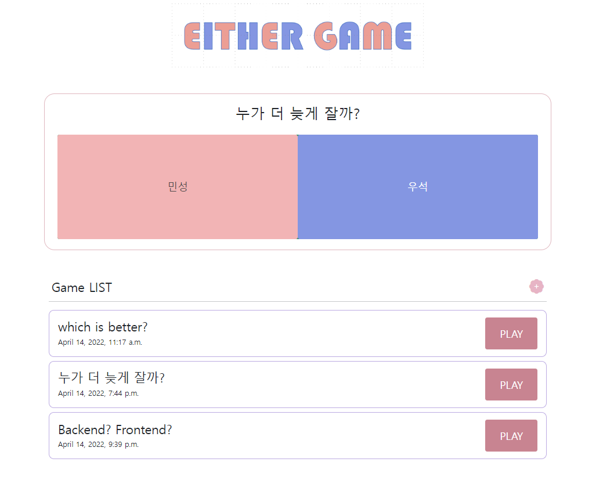
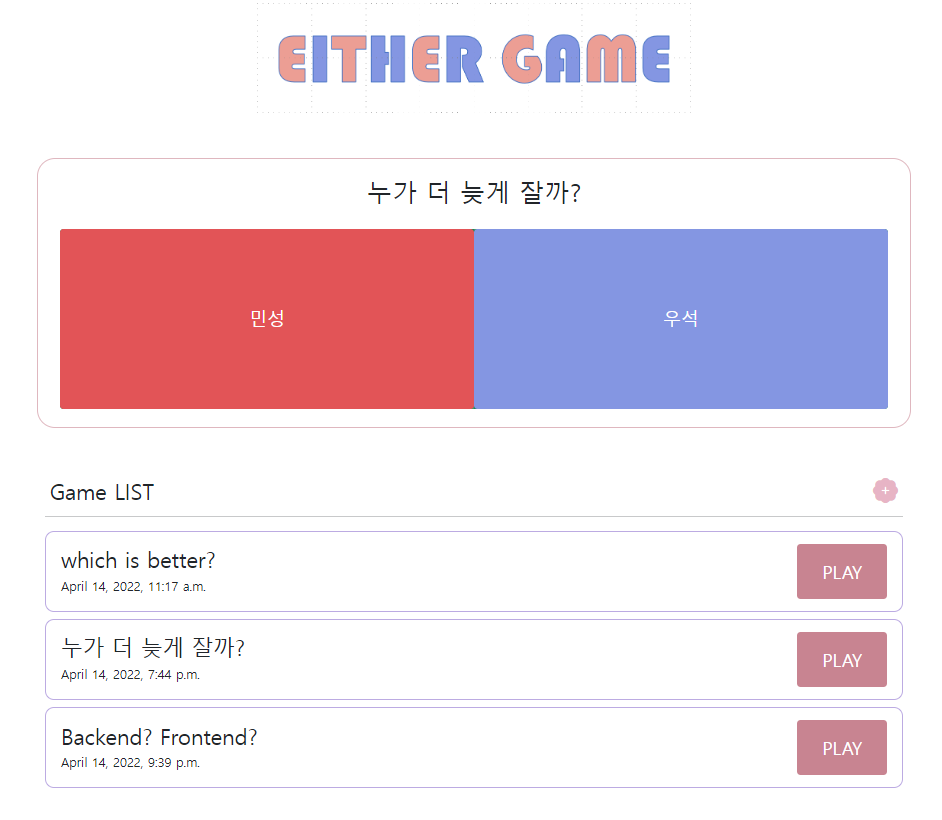
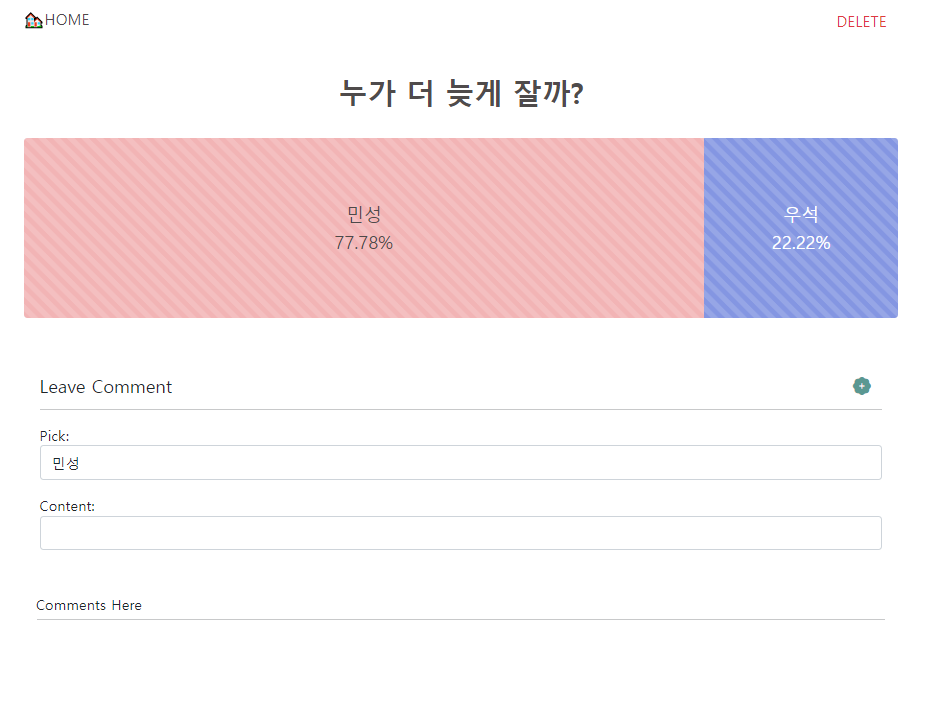
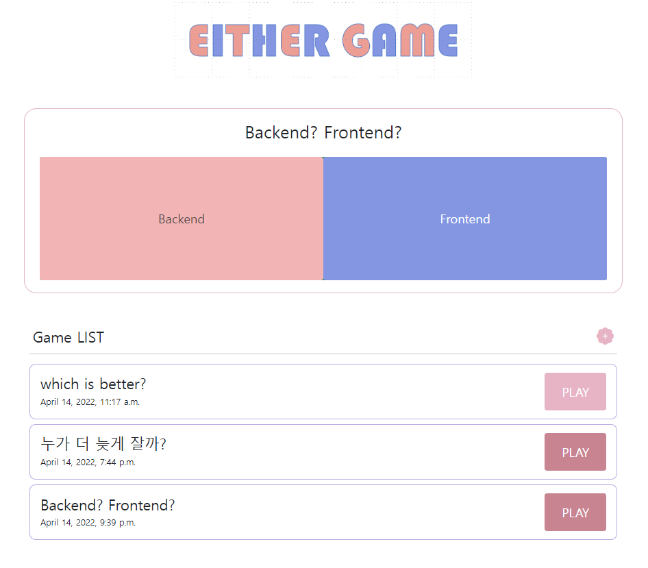
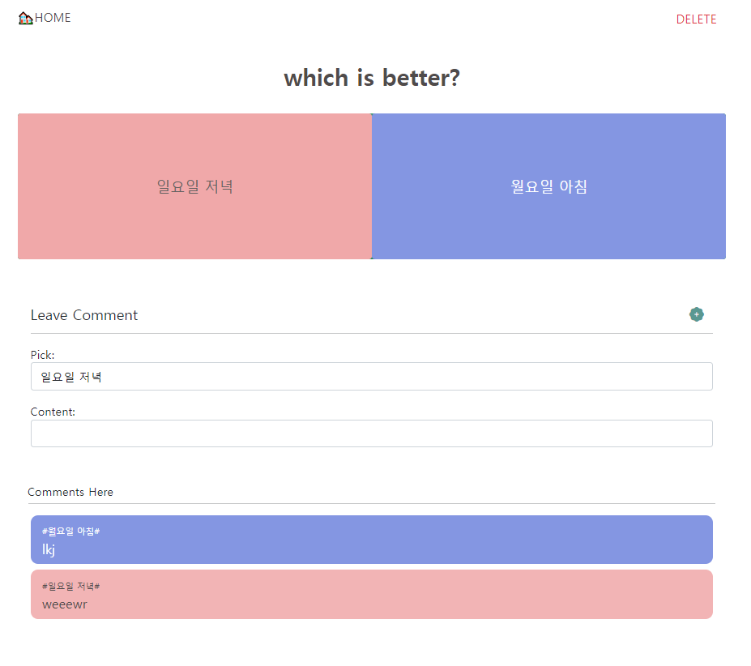
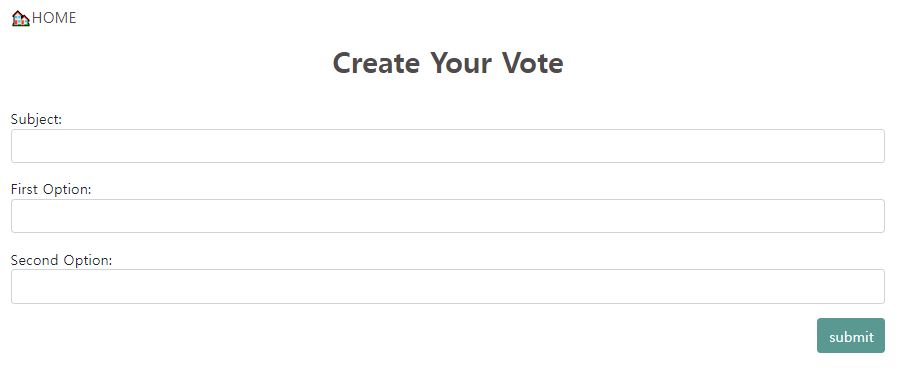
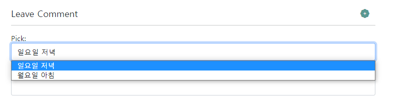

# EITHER

**[서울 1반 김연준]**

-------

### Basic Information

- PJT 날짜 : *2022. 04. 14 (Thu.)*
- 개발환경: vscode, django 3.2+, bootstrap
- 개발언어: python(django), html
- PJT 단위: 개인
- 목표
  - 데이터를 생성, 조회, 수정, 삭제할 수 있는 Web application 제작
  - Django web framework를 통한 데이터 조작
  - ORM(Object Relational Mapping)에 대한 이해
  - ForeignKey를 가지는 모델 조작 및 데이터 활용

---------------------------

### 🤩프로젝트 완성 소감

프로젝트 완성을 위해서 거의 꼬박 하루를 쓴 만큼(밤을 거의,,새버렸네요 ㅎㅎ) 너무 뿌듯하고 또 많은 공부가 됐습니다. 특히 평소 어려워하던 db관련 작업을 주변 도움 없이 혼자의 힘으로 해결한 것이 가장 기쁩니다. Either 프로젝트는 **처음으로 웹 전체 기능을 완전히 구현**하고 (비록 유저 기능은 넣지 못했지만,,ㅎㅎ) 디자인까지 완성한 프로젝트니만큼 오래오래 기억에 남을 것 같습니다!

-------------------

### 📑 What I Learned

#### #1 ERD & Model

개발 준비 단계에서 필요한 데이터를 점검하고 모델링을 시각적으로 나타내는 ERD를 구성하고 도구를 통해 표현하는 방법을 배울 수 있었습니다.



```python
from django.db import models

# Create your models here.
class Vote(models.Model):
    subject = models.CharField(max_length=150)
    choice_one = models.CharField(max_length=300)
    choice_two = models.CharField(max_length=300)
    vote_one = models.IntegerField(default=0)
    vote_two = models.IntegerField(default=0)
    created_at = models.DateTimeField(auto_now_add=True)


class Comment(models.Model):
    vote = models.ForeignKey(
        Vote,
        on_delete= models.CASCADE,
    )
    choice = models.CharField(max_length=300)
    content = models.TextField()
    created_at = models.DateTimeField(auto_now_add=True)
```


#### #2 ForeignKey를 가지는 데이터 활용

ORM 을 활용하여 필요한 데이터를 불러오고, 특히 foreignkey를 가지고 다른 테이블과 연결된 Comment 모델을 활용하면서 모델과 모델의 연결, db 조작에 관해 배울 수 있었습니다.

```python
@require_POST
def create_comment(request, pk):
    vote = Vote.objects.get(pk=pk)
    form = CommentForm(request.POST)
    if form.is_valid():
        comment = form.save(commit=False)
        comment.vote = vote
        comment.save()

    return redirect('votes:detail', pk)
```


#### #3 Frontend design & 프로젝트 완성

디자인을 곁들이고 필요한 추가 기능을 넣어서 나름대로 프로젝트를 완성할 수 있었습니다.

일련의 과정을 구상, 기획 그리고 디자인 하는 과정이 즐거웠습니다 :)

> `컨셉 `: Lovely, Playful, 장난스러운, 놀이
>
> `main color` : mute pink & pastel purple
>
> `logo`: EITHER GAME with maincolors
>
> - 이더 게임의 특성을 잘 나타내고 간단한 학급에서의 놀이 같은 특징을 담아 옅은 그리드 배경의 메인컬러가 번갈아 반복되는 타이포 로고 디자인을 고안
>
>   - Font: BAUHAUS 93 (Published by Microsoft Office 2016)
>   - 상업적 사용 위해서 비용 지불 필요
>
>   


##### #3.1 주요 기능

`메인 페이지의 상단에는 한개이 Either Game이 랜덤으로 표시됩니다`





`상단 게임을 진행하려면 그냥 원하는 쪽을 선택하면 되고, 선택 후에는 결과 디테일 페이지로 이동합니다(각 버튼에는 호버효과 적용) 위와 같은 게임 진행을 위해 comment를 통한 투표방식에서 클릭을 통한 투표 집계, 투표 수 증가를 통한 방식으로 기능을 변경했습니다.`



`결과 디테일 페이지에서는 게임 진행은 불가하고 선택한 후 결과를 볼 수 있습니다. 이 페이지에서도 comment를 달고 볼 수 있습니다`



`game list에서 play버튼을 누르면 디테일 페이지로 이동합니다(위의 +아이콘으로 새로운 game생성 페이지로 이동합니다)`



`기본 디테일 페이지로 기본적인 구성은 결과 페이지와 같지만, 클릭을 통해 플레이가 가능합니다. 마찬가지로 선택을 하면 결과페이지로 이동합니다.`



`게임 생성 페이지`

`모든 게임은 삭제 가능하며 투표라는 게임의 특성상 업데이트는 불가합니다`

-------------

### 💣 What I struggled with

#### #1 Vote 옵션 그대로 Pick으로 가져오기

외래키의 정보를 받아 form의 choice를 변화시키는데 거의 3시간을 혼자 고민했던 것 같습니다 처음에는 form 내에서 함수를 변화하는 방법으로 시도했지만 마지막에는 views.py에서 form을 호출해 변화시키는 방법을 택했습니다.



```python
def detail(request, pk):
    #options: 새로운 choice 리스트
    options =  [(Vote.objects.filter(pk=pk).values_list('choice_one')[0][0],Vote.objects.filter(pk=pk).values_list('choice_one')[0][0]),
         (Vote.objects.filter(pk=pk).values_list('choice_two')[0][0], Vote.objects.filter(pk=pk).values_list('choice_two')[0][0])]

    vote = Vote.objects.get(pk=pk)
    form = CommentForm()
    # widget을 활용한 업데이트
    form.fields['choice'].widget.choices = options
    comments = vote.comment_set.all()
        

    context = {
        'vote':vote,
        'form':form,
        'comments':comments,
    }

    return render(request, 'votes/detail.html', context)
```

